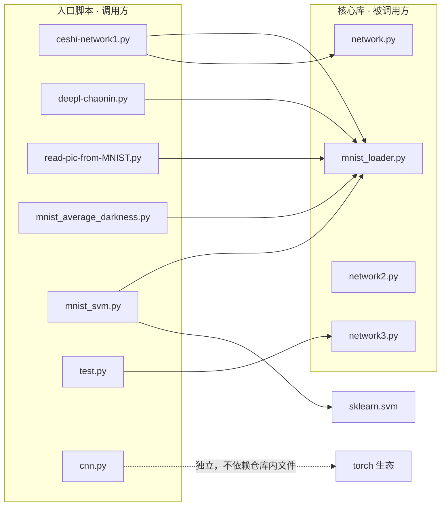
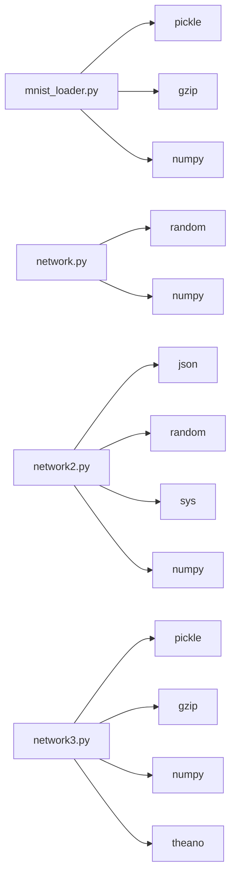
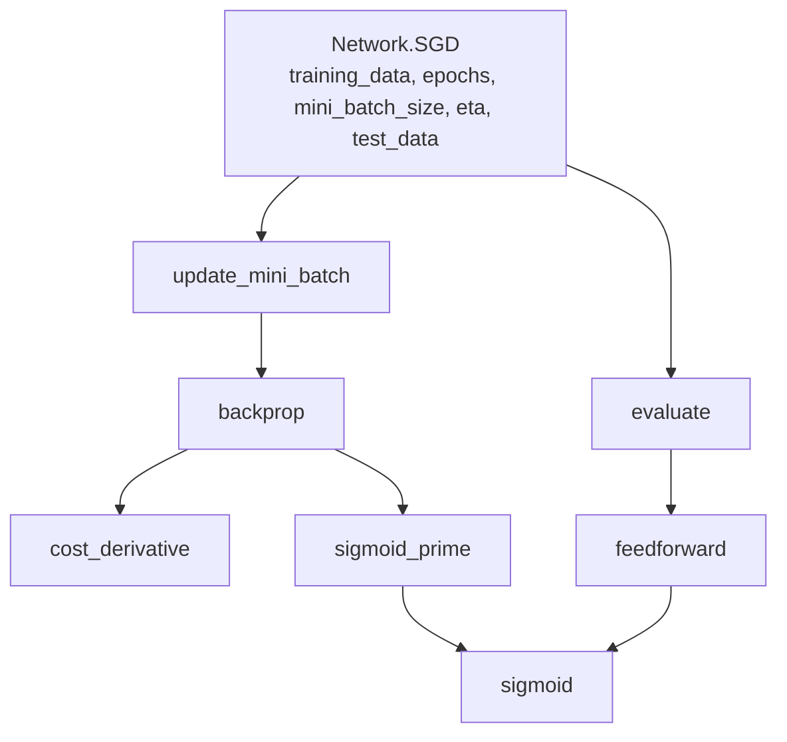
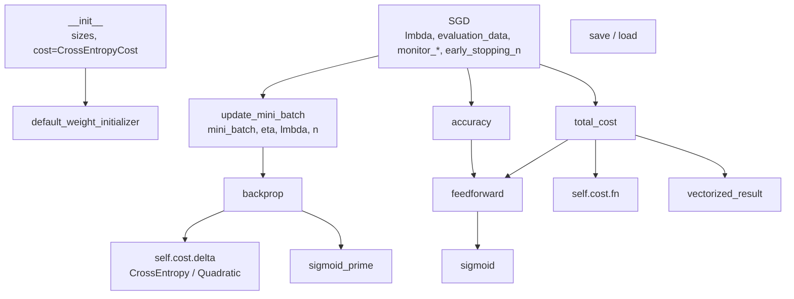
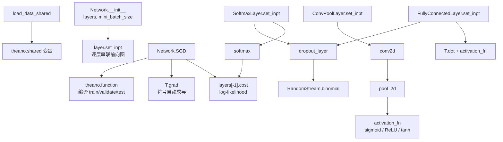
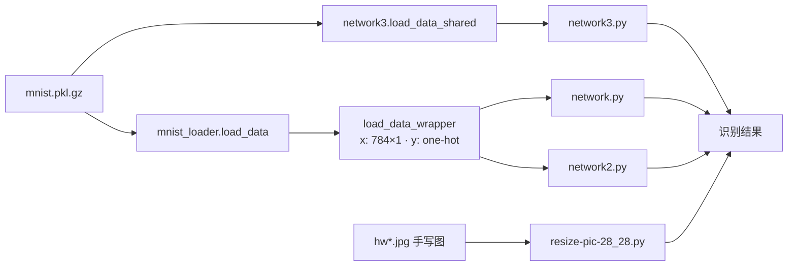

# DeepLearningPython 代码调用关系分析

> 面向教学使用。分析对象：`/Users/chaonin/github/DeepLearningPython`

## 一、项目全景

整个仓库围绕**手写数字识别（MNIST）**这条主线，代码严格对应 Michael Nielsen《Neural Networks and Deep Learning》（neuralnetworksanddeeplearning.com）一书的章节递进：

| 章节 | 文件 | 主题 | 技术 |
|---|---|---|---|
| Ch.1 | `network.py` | 最简神经网络 + SGD + 反向传播 | 纯 NumPy |
| Ch.2–4 | `network2.py` | 交叉熵、正则化、权重初始化、早停 | 纯 NumPy |
| Ch.6 | `network3.py` | 卷积神经网络 | Theano（符号图，可上 GPU） |
| — | `cnn.py` | 独立的教学 CNN 演示 | PyTorch（随机数据，零依赖） |
| 数据 | `mnist_loader.py` | MNIST 加载/封装 | pickle + gzip |

另有一批**工具/教学脚本**和**数据文件**（详见下文）。

---

## 二、文件清单与角色

### 被调用的"库"（核心，本身不主动跑）

- `mnist_loader.py` — 数据层。三个函数：`load_data()`（读 `mnist.pkl.gz`）、`load_data_wrapper()`（把数据格式化成神经网络需要的 `(x, y)` 元组列表）、`vectorized_result(j)`（把数字 0–9 转成 one-hot 向量）。
- `network.py` — Ch.1 网络。`Network` 类，只有一个隐层 30 神经元的经典用法 `[784, 30, 10]`。
- `network2.py` — Ch.2–4 改进版。同名的 `Network` 类 + `QuadraticCost`/`CrossEntropyCost` 两个代价类 + `save/load`（JSON 持久化）。
- `network3.py` — Ch.6 CNN。`Network` + `ConvPoolLayer` / `FullyConnectedLayer` / `SoftmaxLayer` 三种层 + `load_data_shared()` + `dropout_layer()`。

### 主动调用这些库的入口脚本（调用方）

- `test.py` — 官方起点（README 说 `python test.py`），实际只启用了 `network3` 的示例（最后一段），其余 network/network2 示例全被注释。
- `ceshi-network1.py` — 最小可跑：`mnist_loader` + `network`，训练 `[784,30,10]`。
- `deepl-chaonin.py` — 打印 wrapper 后的一条测试数据（network 部分被注释）。
- `mnist_average_darkness.py` — "平均暗度"朴素分类器（**不是**神经网络，作为 baseline 对比）。
- `mnist_svm.py` — SVM baseline（sklearn）。
- `read-pic-from-MNIST.py` — 交互式：读 MNIST 里第 i 库第 j 张图并显示。
- `expand_mnist.py` — 数据增强（平移 1 像素，5 万→25 万张）。**注意是 Python 2 语法**（`cPickle`），不能直接跑。
- `gen-neural-net.py` — 用 matplotlib 画神经网络结构图（教学画图用）。
- `resize-pic-28_28.py` — 把任意手写图片（`hw2.jpg` 等）缩成 28×28 灰度并归一化。
- `cnn.py` — 独立 PyTorch CNN，**随机数据**演示训练流程，不依赖 MNIST 文件。

### 数据 / 资源

- `mnist.pkl.gz` — 主数据集（训练 5 万 / 验证 1 万 / 测试 1 万，784 维）。
- `MNIST/raw/` — 原始 ubyte 格式文件（train-images/labels）。
- `hw2/4/5/6.jpg` + 对应的 `*28_28.jpg` — **手写测试图片**，配合 `resize-pic-28_28.py` 用来让训练好的网络识别自己的手写数字。
- `network3.py.orig` — 未改动的原版备份（对比可看到作者把 `conv.conv2d`、`shared_randomstreams` 换成了新版 Theano-PyMC 的 API）。
- `out`（CSV）、`MyNetwork`（JSON，network2 的 `save()` 产物）、`run-test.readme.25.12.01`（Theano 运行命令）、`path/to/venv`（Python 3.12 虚拟环境）。

---

## 三、调用关系（核心）

### 1. 模块级：谁 import 谁





**关键点**：`network.py`、`network2.py`、`network3.py` 三者**互不依赖**，是同一网络概念的三代实现，各自配合 `mnist_loader` 或 `load_data_shared` 使用。`mnist_loader` 是唯一的数据来源，被几乎所有入门脚本复用。

### 2. 类/函数级调用链

#### network.py（Ch.1，最简）



> 说明：`cost_derivative`（二次代价导数）被**硬编码**在 `backprop` 里，这是 Ch.1 版本与 Ch.2 版本最大的区别。

#### network2.py（Ch.2–4，改进）



> 改进点对应关系：代价**可插拔**（`self.cost.delta`）→ 交叉熵；`update_mini_batch` 里加 L2 正则项；`SGD` 里加早停与监控；`save/load` 用 JSON 持久化。

#### network3.py（Ch.6，Theano 符号图）



> 思路与 Ch.1/2 完全不同：不是"跑一步算一步"，而是**先构建符号计算图，再编译成函数**。`network3.py` 内部的三层管线在 `test.py` 里被拼成网络：

```python
Network([
    ConvPoolLayer(image_shape=(10,1,28,28), filter_shape=(20,1,5,5), poolsize=(2,2)),
    ConvPoolLayer(image_shape=(10,20,12,12), filter_shape=(40,20,5,5), poolsize=(2,2)),
    FullyConnectedLayer(n_in=40*4*4, n_out=100),
    SoftmaxLayer(n_in=100, n_out=10)], 10)
```

### 3. 数据流全景



---

## 四、教学路线建议（按调用关系组织）

这套代码最适合**从数据 → 简单模型 → 深度模型**一条线讲，每一环的调用关系都很清晰：

1. **数据怎么进来**：先讲 `mnist_loader.py` 的 `load_data` → `load_data_wrapper` → `vectorized_result`，让学生理解 `(784×1 向量, one-hot 标签)` 的数据结构。可用 `read-pic-from-MNIST.py` 直观展示"一张图 = 784 个像素"。
2. **最简单的基线**：`mnist_average_darkness.py` 和 `mnist_svm.py` 先跑，让学生有个"神经网络该打败谁"的参照。
3. **第一个神经网络**：`network.py` 讲透 `SGD → update_mini_batch → backprop → feedforward` 这条闭环（这是全书最核心的调用链）。用 `ceshi-network1.py` 直接跑 `[784,30,10]`。
4. **改进点逐个加**：对照 `network.py` vs `network2.py`，每个改进 = 一次调用关系的变化（代价可插拔、正则项进 `update_mini_batch`、早停进 `SGD`）。
5. **上 CNN**：`network3.py` 让学生看到"命令式（一步步算）"到"符号式（先建图再编译）"的范式切换；`cnn.py` 再用 PyTorch 讲一遍同样的 CNN，是最贴近现代写法的收尾。
6. **闭环实战**：用 `resize-pic-28_28.py` 把 `hw2.jpg` 等手写图转 28×28，喂给训练好的网络识别——这是现成的"作业验收"环节。

---

## 五、教学/运行时要注意的坑

1. **`expand_mnist.py` 是 Python 2 代码**（`import cPickle`），直接讲会报错——要么跳过，要么作为"Python 2→3 迁移"的小知识点。
2. **`network3.py` 的 `GPU = True`**：默认强制走 GPU，没装 CUDA 会失败或退化为 CPU。README 末尾的 `run-test.readme.25.12.01` 给了 CPU 跑法：`THEANO_FLAGS="device=cpu,floatX=float32,linker=py,optimizer=fast_compile" python test.py`。Theano 本身已停止维护，环境依赖是这门课最大的不稳定点。
3. **`mnist_loader` 返回的是 `zip` 迭代器**（Python 3 下），必须 `list(...)` 才能复用，`test.py` 开头的注释就演示了这一点。
4. **路径依赖**：`mnist_loader.load_data()` 硬编码打开 `'mnist.pkl.gz'`，脚本必须在**仓库根目录**运行；`expand_mnist.py` 更是写死 `../data/` 路径（且 `data/` 目录当前不存在）。
5. **`network2.py` 的 `SGD` 里 `best_accuracy=1` 又立即改成 `0`**（第 158 行 vs 第 168 行），是明显的冗余遗留，讲代码时正好可以拿来提醒学生"看代码要看最终赋值"。
6. **命名冲突**：三个文件里都有 `Network` 类和 `sigmoid`，`test.py` 用 `from network3 import Network` 显式导入，教学时提醒学生别混用。
